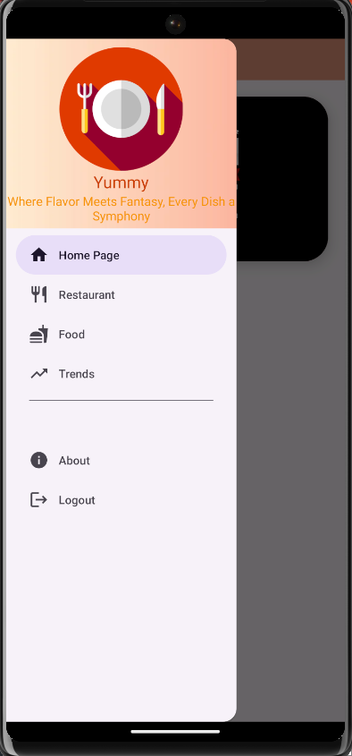

# NavigationDrawer-RecyclerView-ImageSlider-AndroidStudio-Java

In this project, an application similar to a food application was developed in Java in Android Studio. Simply the following user interface features were used in this application:
- Navigation Drawer
- Recycler View
- Image Slider

### Navigation Drawer

-In this application, a vertical navigation drawer has been developed. First, an Android resource directory named "menu" was created under the "res" folder. In this "menu" directory, the items intended to appear in the navigation drawer's content were defined. Typically, these elements are specified with a name, an icon, and an ID. This method is a common approach used to organize the content of the navigation drawer and facilitate user navigation within the application.

-Subsequently, a header was created. Both the header and the item list were defined within the "navigationView" inside the main activity. Similarly, a custom toolbar was designed and placed in the relative layout of the main activity.

-By default, Home Page is selected at first startup.   

  

  
-Related components: nav_menu, nav_header,custom_toolbar, activity_main and MainActivity

### Recycler View
-When the 'Food' option is selected in the navigation drawer, you will notice a horizontal RecyclerView displaying multiple food images. 
-To enable this functionality, we have implemented a data class and an adapter class to manage the properties of each item within the RecyclerView.
-Afterward, we populated the RecyclerView by assigning values to a one-dimensional array of type FoodData within the Food class.

